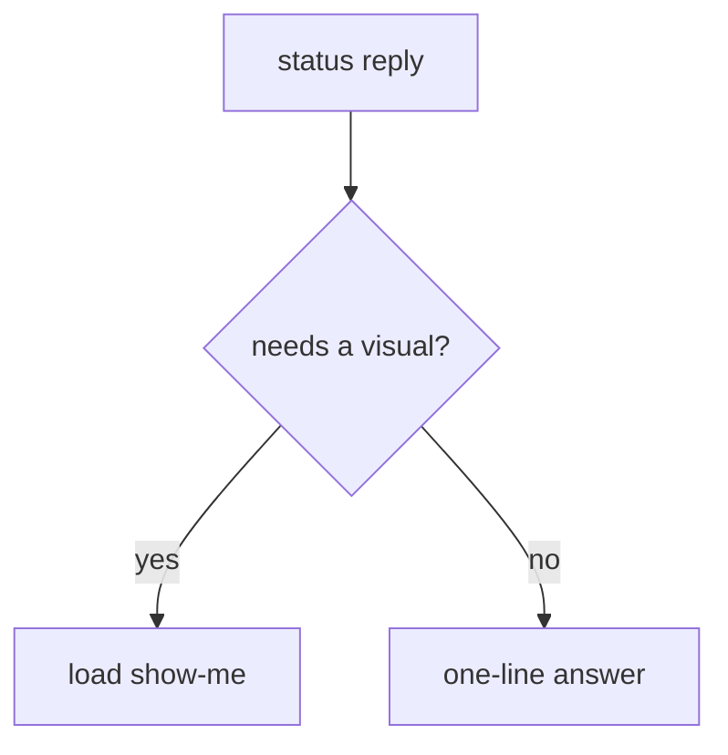

# show-me — One shape, fenced text by default

**Purpose**  
The recipe book for the single visual a reply needs. `reply-contract` decides *whether* a visual belongs in a status/your-turn reply and loads this file for *how* to build it — this file never gets reimplemented inline in `reply-contract` or anywhere else.

**Trigger**  
"Show the shape" or "show-me" before writing code; loaded automatically by `skills/reply-contract/SKILL.md` whenever a status/your-turn reply needs more than a one-line answer.

**Do not use for**  
- Aligning on domain language before code in rounds of questions — that is `grill-with-docs`.
- A saved, formal architecture or spec diagram meant to live in `docs/` — that is `diagram-design`, a different skill with a different output (a persisted artifact, not a disposable per-reply visual).
- Long-form prose formatting or rewriting — that is `scroll-craft`.
- Tone/humanizing rewrite passes — that is a Hermes-style humanizer. show-me never touches voice; voice and marks stay owned by `reply-contract`.

---

## One primary visual per reply

Pick the smallest recipe below that makes the next action obvious, then stop.

- One recipe, one fenced block. Never two visuals (a tree *and* a diff) in the same reply.
- The tree *is* the sequence. Never number the steps *and* show a tree.
- Default output on Photon / iMessage and every other narrow channel: fenced `text` trees, stacks, and diffs only.
- Mermaid or an HTML file is opt-in only — build it when the user explicitly asks for either, never by default.
- Never write a command that opens a generated visual for the human (no `Bash(open file.html)`, no launching a browser). The visual is read directly in the reply, not launched from a shell.
- No multi-visual dumps: a gallery of three fenced blocks is not "one primary visual."

## Recipe: call tree

Use for tap/click/function call order — screens, buttons, or calls as nodes, indented by nesting.

```text
Simulator / Wod iPhone 17
  **Profile** → sign in as A
  **Today** → start today's workout
  **Session**
    type two sets on one lift
    undo last set → it vanishes
  **Profile** → sign out
```

## Recipe: file/screen tree

Use for "where does the work sit" — files touched, or screens in an app, as a tree.

```text
skills/show-me/
  SKILL.md          # this file — recipes only
  fixtures/
    reply-contract-link-check/
      case.json
```

## Recipe: stack

Use for "who is waiting on whom" — a blocking chain, top of stack is the current blocker.

```text
waiting on: human review (PR #12)
  blocked by: QA pass
    blocked by: fixture capture
```

## Recipe: diff of a shape

Use for "what changed" between two trees or stacks — never a code diff, only the shape.

```text
  reply-contract
    pairing line
-     "pairs with show-me" (no path)
+     "loads skills/show-me/SKILL.md" (real path)
```

## Recipe: mermaid (opt-in only)

Use only when the user explicitly asked for control-flow mermaid. Still one fenced block, still the only visual in the reply.

````text

````

## Credit

Inspired by the idea behind HumanLayer / Dex Horthy's `show-me` (see the announcement at `https://x.com/dexhorthy/status/2087569590268391897`), an MIT-licensed concept: pick one small visual instead of a wall of prose. This skill is an independent, from-scratch rewrite scoped to this hub's recipes and channel constraints — it does not copy HumanLayer's plugin directory layout, install mechanism, or its `Bash(open ...html)` guidance. This hub's rule is the opposite: never shell out to open a visual for the human.

## Pitfalls

1. Two visuals in one reply (a tree and a diff, or a tree and mermaid)
2. Numbered steps *and* a tree for the same sequence
3. Mermaid or an HTML file on a narrow channel without being asked
4. Never a `Bash(open ...html)`-style command to launch a generated visual
5. Reimplementing these recipes inside `reply-contract` instead of loading this file
6. Confusing this skill with `diagram-design` (persisted spec diagrams), `scroll-craft` (prose craft), a Hermes-style humanizer (tone rewrite), or `grill-with-docs` (question rounds before code)
7. A tree with no gloss in prose — new facts still need a plain-English line next to the visual (see `reply-contract`)

## Verification

- [ ] Exactly one recipe, one fenced block, for this reply
- [ ] Fenced `text` by default; mermaid/HTML only if the user asked
- [ ] No shell/browser command opens the visual
- [ ] The tree is the sequence — no parallel numbered list
- [ ] Voice, marks, and gloss stay in the caller (usually `reply-contract`); this file supplied only the shape
