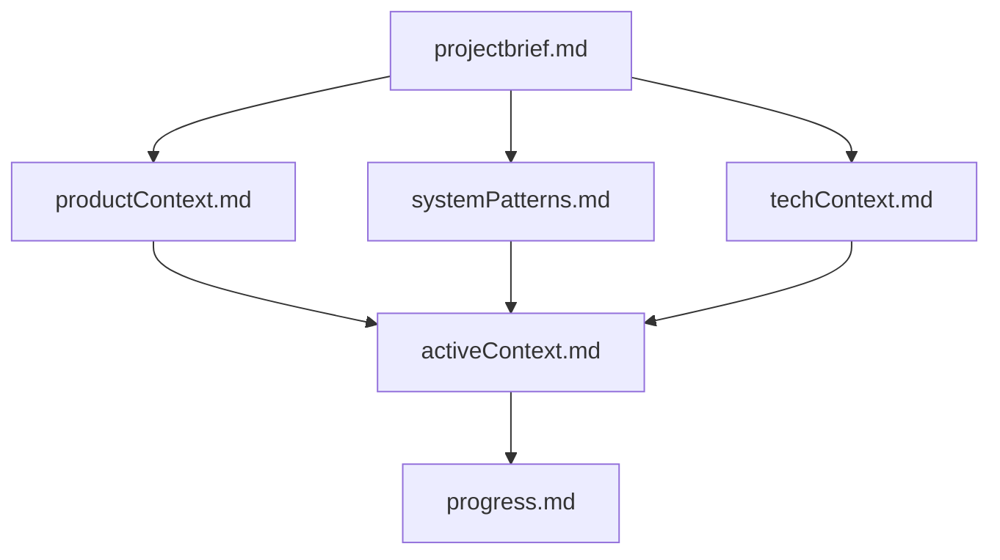

# memory-bank-protocol.md — Memory Bank Setup and Maintenance Skill

**Purpose**  
This skill formalizes the Memory Bank concept (as defined in this hub's memory-bank/ directory and protocol) into a reusable, mandatory protocol for **any** long-running project. It guarantees perfect context continuity across sessions, different agent harnesses (Claude, Cline, etc.), and even multi-month tasks where chat history is useless.

The Memory Bank is the **only** source of truth. Your memory resets completely between sessions — this is the cure.

**When to Use This Skill**
- **Initializing** a brand new project (create the directory + 6 core files)
- **At the absolute start** of every new session or before **any significant task** (non-optional read of all 6 files)
- **At the end of every task** (update activeContext.md + progress.md + propose wiki update)
- When switching projects via `manifest.yaml`
- When onboarding a new harness or team member to an existing project

**Core Principle** (verbatim from source)
> My memory resets completely between sessions. The Memory Bank is the **only** source of continuity and the single source of truth for the project. I **must** read all core Memory Bank files at the start of every new session and before any significant task. This is non-optional.

## File Structure
All files live in the `memory-bank/` directory (create it if it does not exist) at the **project root** (use absolute path). Written in clean Markdown.

### The 6 Core Files (Always Required — Read in This Exact Order)

1. **`projectbrief.md`**  
   Project foundation, scope, and core goals/requirements.  
   *Rarely changes after initial setup.*

2. **`productContext.md`**  
   Project purpose, problems solved, user experience goals, and success criteria.

3. **`systemPatterns.md`**  
   Architecture, design patterns, key technical decisions, and component relationships.

4. **`techContext.md`**  
   Technologies, tools, development setup, constraints, dependencies, and conventions.

5. **`activeContext.md`**  
   Current focus, recent changes, active decisions, open questions, and next steps.  
   *(Most volatile — update frequently.)*

6. **`progress.md`**  
   Project status, what works, remaining work, known issues, and important learnings.

### Visual Hierarchy


## Initialization Steps (New Project)
1. Create the directory using absolute path:
   ```bash
   mkdir -p /absolute/path/to/your-project/memory-bank
   ```
2. Create the 6 empty `.md` files (or copy templates from this hub's `memory-bank/` as starting point).
3. Populate them based on current project understanding (use `write_file` tool).
   - Start with `projectbrief.md` — be concise but complete.
   - Fill others progressively as you learn.
4. Add the project to `manifest.yaml` (with `memory_bank_path` pointing to the new directory).
5. Run the **Mandatory Read Protocol** (below) to verify.

**Pro Tip**: Use the 6 files in *this* repo's `memory-bank/` as live templates — they were created following this exact skill.

## Mandatory Read Protocol (Start of Every Session / Task)
**You MUST execute this before any other action on a significant task.**

1. Switch to the correct project context (via `manifest.yaml` if multi-project).
2. Read **all 6 files in parallel** where your harness supports it (or sequentially in the order above):
   ```bash
   # Example using available tools (adapt to your harness)
   read_file /absolute/path/to/project/memory-bank/projectbrief.md
   read_file /absolute/path/to/project/memory-bank/productContext.md
   # ... (repeat for systemPatterns, techContext, activeContext, progress)
   ```
3. **Internalize** the full context before responding to the user or starting work.
4. If any file is missing or empty: Pause and initialize it using this skill.

**Warning**  
> Skipping this read = instant amnesia. The chat history is **not** the source of truth. The files are. Violating this rule breaks the entire system.

## Update Protocol (End of Every Task)
After completing work (especially in the FINALIZE phase of plan-code-review-workflow):

1. **Update `activeContext.md`**:
   - Clear any completed "Current Plan" or "Next Steps".
   - Add new open questions, decisions made, or focus for next session.
   - Example addition:
     ```markdown
     ## Current Focus (Post-Task)
     - Memory Bank skill now fully implemented as `skills/memory-bank-protocol.md`.
     - All references in AGENTS.md updated.
     ```

2. **Update `progress.md`**:
   - Add a new bullet under "What Works" or "Important Learnings".
   - Record: what was delivered, any gotchas discovered, links to wiki entries created.
   - Example:
     ```markdown
     - [x] Added memory-bank-protocol.md skill (complete playbook with init/read/update steps, based on the Memory Bank concept in this hub).
     - Learned: Parallel reads of the 6 files dramatically improve context loading speed in supported harnesses.
     ```

3. Update memory-bank/ files with any new insights from the task.

4. **Verify** by re-reading the two updated files.

## Integration with Other Skills & Subagents
- **plan-code-review-workflow.md**: Explicitly calls this protocol in PLAN phase (step 1) and FINALIZE phase (step 5).
- **All agents**: software-architect, software-engineer, qa-critical-reviewer, and ui-ux-engineer must reference memory-bank/ in their behaviors.
- memory-bank/ holds per-project state and is the primary knowledge layer.
- **AGENTS.md**: This skill is now listed under "Other Key Skills" and is the enforcement mechanism for the global "Context Management" rule.
- **docs-protocol.md**: Governs the complementary `docs/` layer. See below.

## memory-bank/ vs docs/ — Know the Difference

This hub uses two complementary layers. Never mix them:

| Layer | `memory-bank/` | `docs/` |
|---|---|---|
| **Purpose** | Agent operational state | Persistent technical reference |
| **Content** | Current focus, active decisions, session progress | API contracts, data schemas, pipeline, ADRs |
| **Read by** | Agents at **every** session start (mandatory) | Humans + agents on demand |
| **Updated** | After every significant task | When technical specs or decisions change |
| **Analogy** | RAM / working memory | Engineering wiki |

**Decision rule:**
- "What are we working on?" → `memory-bank/activeContext.md`
- "What does the API look like?" → `docs/projects/<name>/api-contracts.md`
- "Why did we choose PostgreSQL?" → `docs/projects/<name>/decisions.md`

> **Don't put technical reference in memory-bank.** It doesn't belong in operational state and will cause context bloat. Use `docs/` (see `skills/docs-protocol.md`).

## Example Invocation
User: "Follow the memory-bank-protocol skill to set up a Memory Bank for my new 6-month refactor project at /home/user/my-refactor."

Agent (as Software Architect):  
"Loading memory-bank-protocol... Creating directory and 6 core files at absolute path... Populating initial content from projectbrief... Running mandatory read... Context fully loaded. Here's the plan for the refactor..."

## Self-Hosting Note (This Repo)
This very `memory-bank/` directory you are reading from was created and is maintained using this skill. It serves as the canonical, battle-tested example.

**Last updated**: 2026-04-28 | Version: 1.0 | Part of Multi-Agent Skills Hub v0.1.0 (self-hosting)